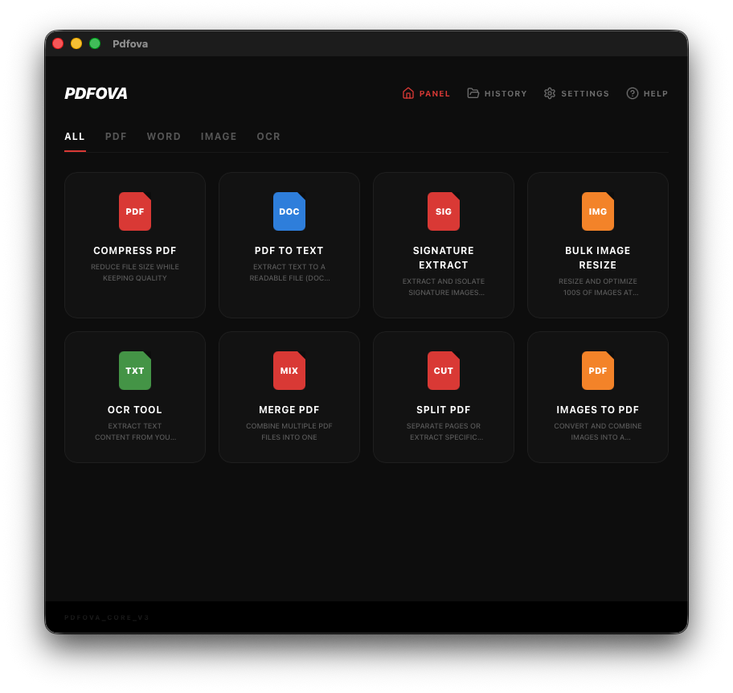
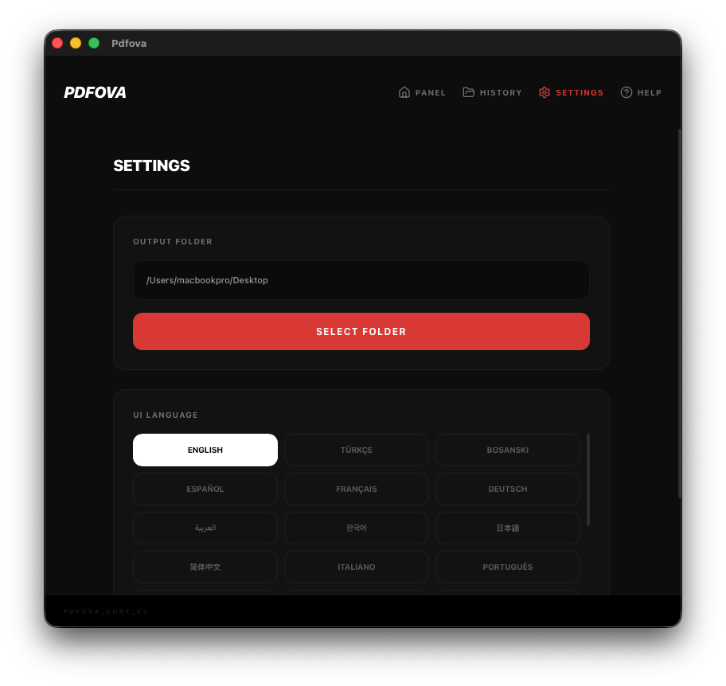
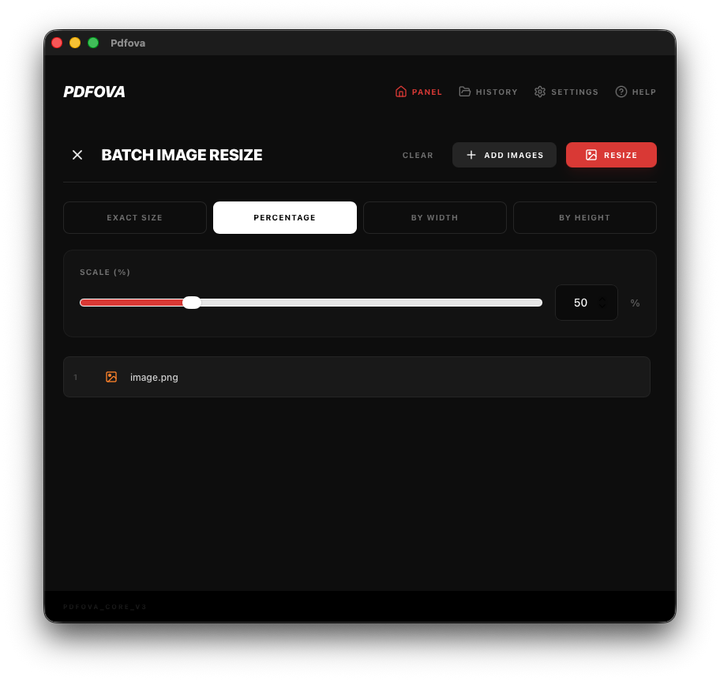
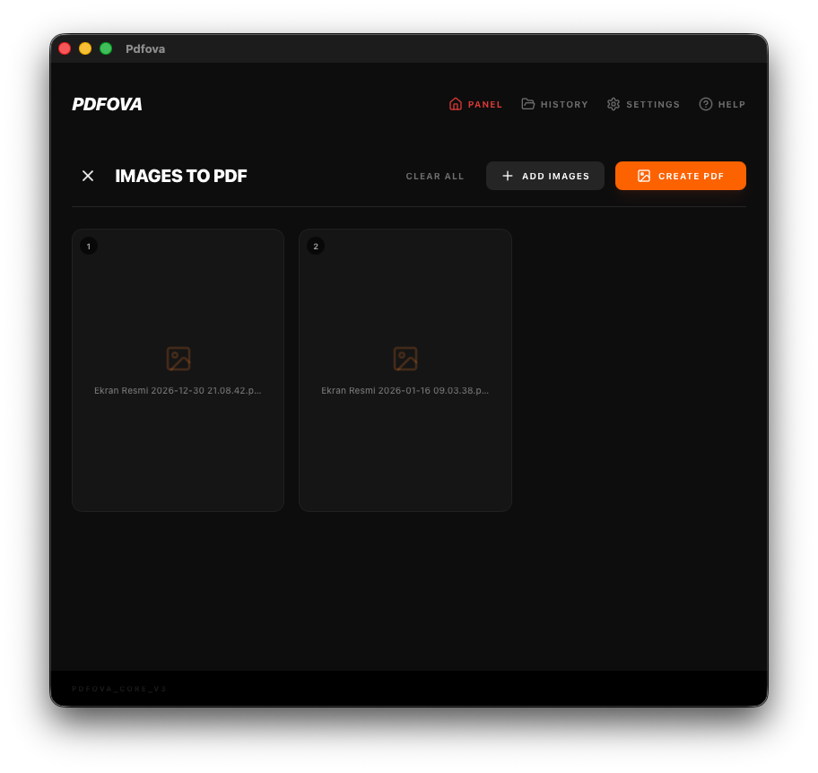
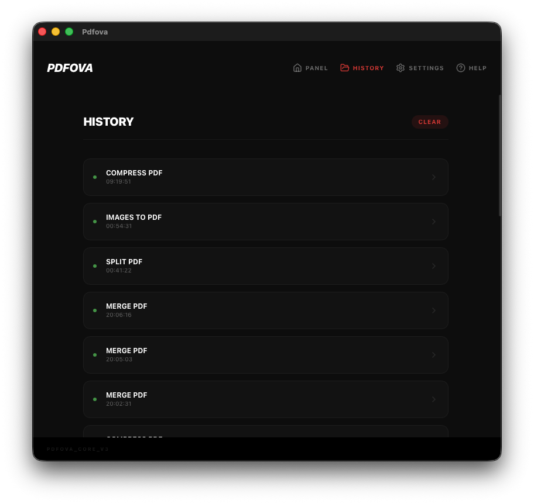

<p align="center">
  
</p>

# Pdfova

**Pdfova** is a high-performance, cross-platform desktop tool for **PDF & Image processing**. It brings the comfort of tools like Smallpdf and iLovePDF to a native, offline application — powered by Rust and Tauri.




## Features

- **PDF Compression:** Reduce file size without compromising quality.
- **PDF Merger:** Professional-grade merging with proper object handling (fully compatible with Apple Preview).
- **PDF Splitter (Visual):** Preview all pages and select specific ones to extract or split the whole document.
- **Batch Image Resize:** Process 100s of images at once with 4 scaling modes (Exact, Percent, Width-only, Height-only).
- **Images to PDF:** Convert and combine multiple images (JPG, PNG, WebP) into a single document.
- **PDF to Word / Text:** Convert PDF documents to editable content.
- **Signature Extraction:** Detect and isolate signature images from PDFs.
- **Text Extraction (OCR):** Extract text content from scanned documents.

## Screenshots

<p align="center">
  
  
</p>
<p align="center">
  
  
</p>
<p align="center">
  
  
</p>

## Key Advantages

- **Cross-Platform:** Native builds for macOS, Windows, and Linux.
- **Privacy First:** All processing happens locally on your machine. No cloud, no uploads.
- **Fast:** Powered by Rust for lightning-fast processing.
- **Modern UI:** Minimalist dark mode with smooth React-powered animations.

## Installation

### macOS (Intel & Apple Silicon)
1. Download the `.dmg` from [Releases](https://github.com/tamert/pdfova/releases).
2. **Note:** Since the app is not signed with an Apple Developer certificate, macOS might show a "Damaged" error. To fix this, run the following command in Terminal:
   ```bash
   sudo xattr -cr /Applications/Pdfova.app
   ```
3. **Homebrew (Draft):** You can use the local cask file in `dist-scripts/homebrew/`.

### Windows 
Download the `.msi` or `.exe` from the [Releases](https://github.com/tamert/pdfova/releases).

### Linux (Pardus, Ubuntu, Debian)
- **Debian/Pardus (.deb):** 
  ```bash
  sudo apt install ./pdfova_0.3.0_amd64.deb
  ```
- **Portable (.AppImage):** Download the `.AppImage` from Releases, make it executable, and run.
- **Flatpak:** Manifesto and build guide available in `dist-scripts/flatpak/`.

## Tech Stack

- **Backend:** [Rust](https://www.rust-lang.org/) (lopdf, image-rs).
- **Frontend:** [React](https://reactjs.org/) + [Vite](https://vitejs.dev/) + [Tailwind CSS](https://tailwindcss.com/).
- **Bridge:** [Tauri v2](https://tauri.app/).

## Development

To build Pdfova from source:

1. **Clone & Install:**
   ```bash
   git clone https://github.com/tamert/pdfova.git
   npm install
   ```
2. **Run Dev:**
   ```bash
   npm run tauri dev
   ```
3. **Build:**
   ```bash
   npm run tauri build
   ```

## Roadmap

- [x] Full Turkish character support
- [x] Robust PDF Merger (Preview compatibility)
- [x] Batch Image Resizing UI
- [x] GitHub Actions automated releases
- [x] Homebrew / Flatpak distribution scripts
- [x] Images to PDF conversion tool
- [ ] Real OCR via Tesseract integration
- [ ] Drag & drop file support on main tool cards

## License

Licensed under the [GPL-3.0 License](LICENSE).

---
Created by [Tamer](https://github.com/tamert) for the Open Source Community.
