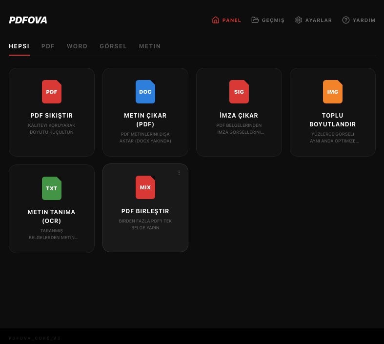

# Pdfova 🚀

**Pdfova** is a high-performance, cross-platform desktop tool for **PDF & Image processing**. It brings the comfort of tools like Smallpdf and iLovePDF to a native, offline application — powered by Rust and Tauri.




## ✨ Features

- 📉 **PDF Compression:** Reduce file size without compromising quality.
- 📝 **PDF to Word:** Convert PDF documents to editable Word (.docx) files.
- 🖋️ **Signature Extraction:** Detect and extract signature candidates from PDFs. *(Basic — image-level detection)*
- 🖼️ **Image Resizing:** High-quality image resizing with Lanczos3 filter.
- 🔍 **Text Extraction (OCR):** Extract embedded text from PDF documents. *(Embedded text only — Tesseract OCR planned)*
- 🔗 **PDF Merger:** Quick and easy combining of multiple PDF files.

## 🚀 Key Advantages

- **Cross-Platform:** Runs on macOS, Linux, and Windows.
- **Offline Working:** Your documents stay private; no cloud uploads required.
- **Modern Dark UI:** Sleek, minimal interface with smooth animations.
- **History Tracking:** Built-in activity log for all processed files.

## 🛠️ Tech Stack

- **Backend:** [Rust](https://www.rust-lang.org/) for safety and performance.
- **Frontend:** [React](https://reactjs.org/) + [Vite](https://vitejs.dev/) + [Tailwind CSS](https://tailwindcss.com/).
- **Bridge:** [Tauri v2](https://tauri.app/) for small binaries and native OS integration.

## 📦 Installation

### macOS
Download the latest `.dmg` from the [Releases](https://github.com/tamert/pdfova/releases) page.

### Linux (Debian / Ubuntu / Pardus)
Download the latest `.deb` package from the [Releases](https://github.com/tamert/pdfova/releases) page:
```bash
sudo apt install ./pdfova_0.1.1_amd64.deb
```

### Windows
Download the latest `.msi` installer from the [Releases](https://github.com/tamert/pdfova/releases) page.

## 🛠️ Development

To build Pdfova from source, you'll need Rust and Node.js installed.

1. **Clone the repo:**
   ```bash
   git clone https://github.com/tamert/pdfova.git
   cd pdfova
   ```
2. **Install dependencies:**
   ```bash
   npm install
   ```
3. **Run in development mode:**
   ```bash
   npm run tauri dev
   ```
4. **Build for production:**
   ```bash
   npm run tauri build
   ```

## 🗺️ Roadmap

- [ ] Real OCR via Tesseract integration
- [ ] Full signature image extraction
- [ ] Bulk (multi-file) image resizing
- [ ] Drag & drop file support
- [ ] Flatpak / Homebrew distribution

## 📄 License

Licensed under the [GPL-3.0 License](LICENSE).

---
Created by [Tamer](https://github.com/tamert) with ❤️ for the Open Source Community.
